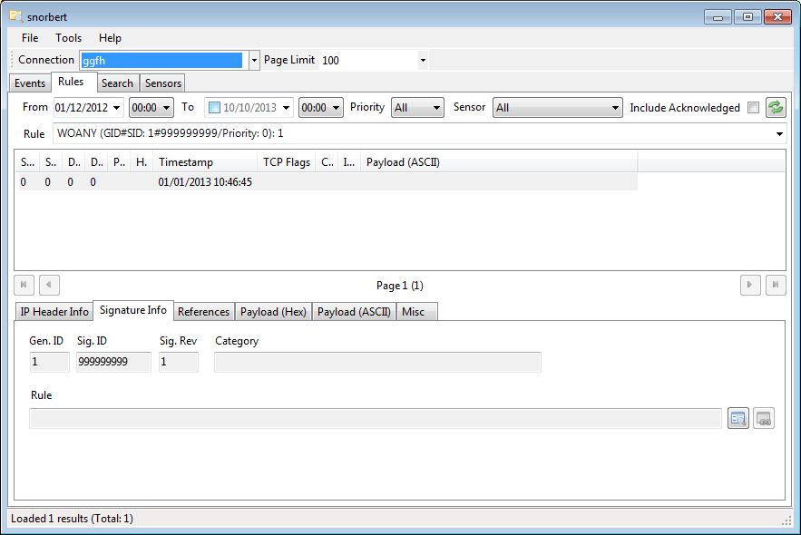

# {{ page.title }} #

## Info ##
snorbert is a snort data viewer, loosely based on [snorby](https://snorby.org/). It is written in C# and uses .Net 4.0. The aim of the application is to provide a fast, usable interface for accessing snort data. Depending on the snort deployment, the underlying data set can be extremely large, so care has been taken to optimise the data access.

## Features ##

- Paged data access
- Configuration for multiple snort instances
- Signature based grouping of events
- User configurable searching
- Correlation of snort signatures to events for easy viewing of the signatures
- Query integration with NetWitness for quick session identification

## Third party libraries ##

- [ObjectListView](http://objectlistview.sourceforge.net/cs/index.html) : Data viewing via lists
- [CsvHelper](https://github.com/JoshClose/CsvHelper): CSV output
- [Be.HexEditor](http://sourceforge.net/projects/hexbox/) : HEX view of packet data
- [IP Address Control](https://code.google.com/p/ipaddresscontrollib/) : Easy validation of IP addresses
- [MySql](http://dev.mysql.com/downloads/connector/net/) : Access to snort MySQL databases
- Utility (woanware) : My helper library
- [NPoco](http://dev.mysql.com/downloads/connector/net/): Data access

## Requirements ##

- Microsoft .NET Framework v4.0

## Screenshot ##

## Download ##

- [Source Code](https://github.com/woanware/snorbert)
- [Binaries (v1.2.0)](/downloads/snorbert.v1.2.0.zip)